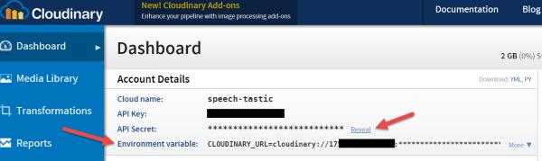

# Speech-Tastic
Website to display Speech Therapy related blog posts and products.

## Development System Setup

#### Setup Cloudinary

- You need to go to your [Cloudinary console](https://cloudinary.com/console) and grab the Environment variable.
 - 
- Update the environment variable for all users in Ubuntu
 - From a shell run `sudo nano /etc/profile` and add the CLOUDINARY_URL environment variable to this file prepending it with 'export'
 - `export CLOUDINARY_URL=cloudinary://17.......`
- Log out and log back in to see changes
 - To test run this: `echo $CLOUDINARY_URL`

### Connect to Heroku

- Staging  `heroku git:remote -a frozen-plateau-7971`

## Deployment

### Staging

- Staging is deployed to Heroku
- URL: http://staging.speech-stastic.com
- Deployment
 - Pull down the latest code to the Master branch then run
 - `git push heroku master`
 - If there were database changes then run
 - `heroku run rake db:migrate`

